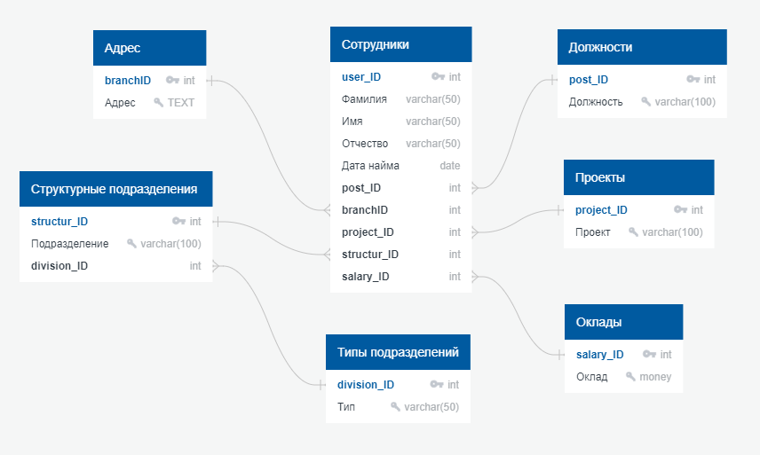

# Домашнее задание к занятию "Домашнее задание к занятию «Базы данных»" - Файзиев Давлат.

### Легенда

Заказчик передал вам [файл в формате Excel](https://github.com/netology-code/sdb-homeworks/blob/main/resources/hw-12-1.xlsx), в котором сформирован отчёт. 

На основе этого отчёта нужно выполнить следующие задания.

### Задание 1

Опишите не менее семи таблиц, из которых состоит база данных:

- какие данные хранятся в этих таблицах;
- какой тип данных у столбцов в этих таблицах, если данные хранятся в PostgreSQL.

Приведите решение к следующему виду:

Сотрудники (

- идентификатор, первичный ключ, serial,
- фамилия varchar(50),
- ...
- идентификатор структурного подразделения, внешний ключ, integer).

### Решение 1
Скриншоты ER-диаграммы:

---
